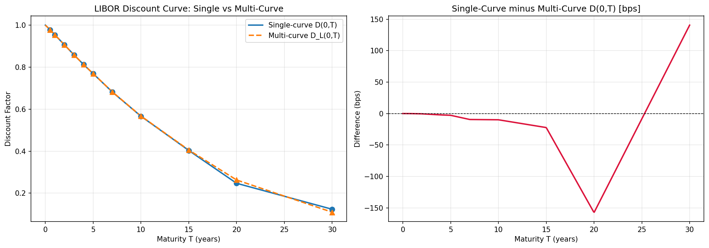
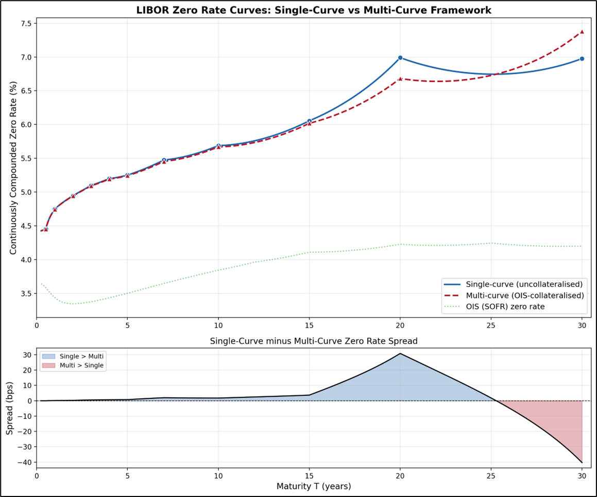
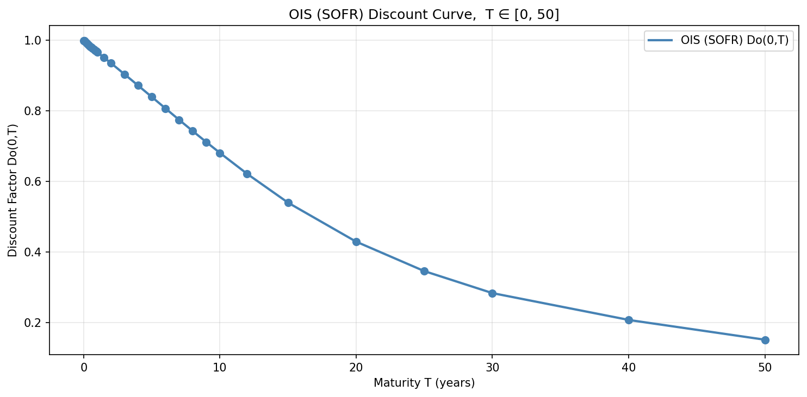
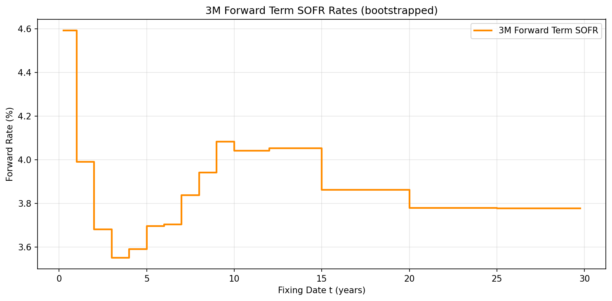
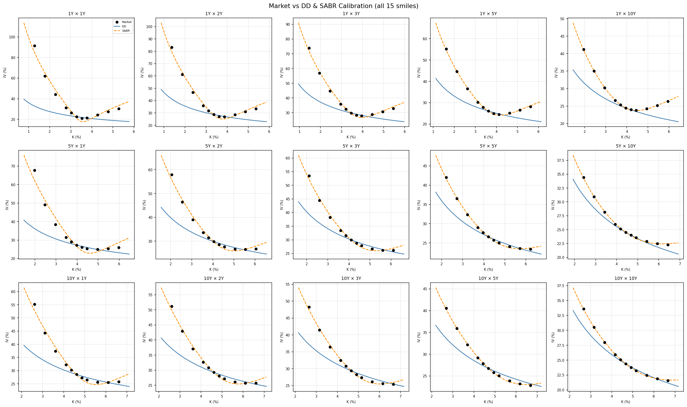
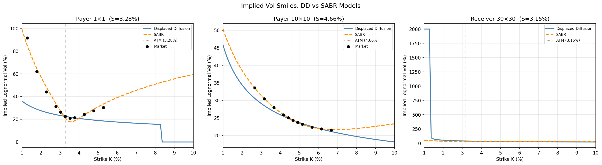
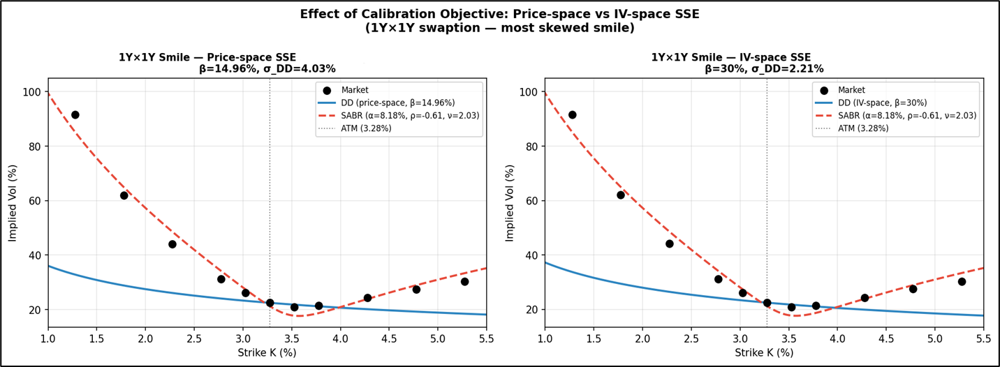
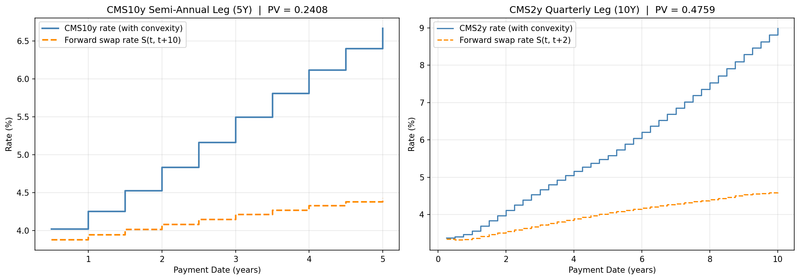
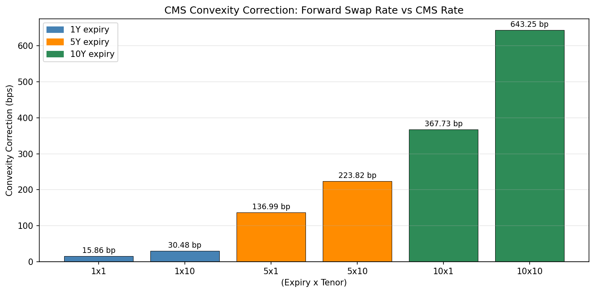

# Multi-Curve-Swap-Modeling-Swaption-Smile-Calibration-CMS-Convexity-Pricing

---

This report covers three interconnected components of interest rate derivatives pricing:
1. **Swap curve bootstrapping** — LIBOR (single- and multi-curve) and OIS/SOFR curves
2. **Swaption calibration** — Displaced Diffusion (DD) and SABR models
3. **CMS valuation** — Convexity correction via Hagan's static replication

## Executive Summary

### Part I — Bootstrapping Swap Curves (`part1.py`)
The data comes from a single Excel workbook with three sheets: LIBOR (legacy), OIS (SOFR), and OIS (Term SOFR).

OIS bootstrap handles two regimes. For T ≤ 1Y the instruments are zero-coupon (simple interest), so D(0,T) = 1/(1 + r·T) directly. For T > 1Y the instruments are annual fixed-coupon OIS swaps, so each new pillar's DF is solved by stripping out the previously-known coupon cash flows. One subtlety: the code handles non-integer pillars (e.g., 18M) separately from integer ones, using a stub fraction for the last coupon period. Results: Do(10Y) ≈ 0.681, Do(20Y) ≈ 0.429, Do(50Y) ≈ 0.152, implying roughly 3.8–4.0% risk-free rate.

LIBOR single-curve bootstrap uses semi-annual 30/360 conventions throughout. The 6M cash deposit seeds the first DF; every subsequent pillar is solved by the standard par-swap condition where fixed and floating PVs are equal, using the same curve for both discounting and projection. Linear interpolation on DFs handles intermediate coupon dates.

LIBOR multi-curve bootstrap is the more interesting one. It separates discounting (OIS DFs) from forward projection (LIBOR DFs). The algorithm works by assuming a flat forward rate between consecutive LIBOR pillars. For each new pillar, it: (1) computes the OIS-discounted fixed-leg annuity A_OIS(T) over the full swap tenor, (2) sums the already-known float PV from prior blocks, (3) solves for the single flat forward rate f_new in the new block, and (4) compounds back to get the LIBOR projection DF. The divergence between single and multi curves is negligible below 10Y (<2 bps) but grows substantially at long tenors — 31 bps at 20Y, before a crossover where the multi-curve is 40 bps higher at 30Y. The crossover arises because OIS discounting gives more weight to far-dated cashflows, requiring bootstrapped LIBOR forwards to be higher to reprice the same par rates.

Term SOFR bootstrap uses annual-frequency SOFR swap quotes with quarterly floating payments. Same flat-forward logic, but now the fixed leg pays annually and the float leg pays quarterly. It then interpolates log-linearly between annual pillars to build a quarterly DF grid, from which 3M forward rates are extracted. The resulting curve has a humped shape: starts ~4.59% (current SOFR), dips to ~3.55% at 3Y (market pricing Fed cuts), then recovers to ~4.1% at 9–15Y.

### Part II — Swaption Calibration (`part2.py`)
The swaption dataset covers 15 expiry×tenor pairs (1Y, 5Y, 10Y expiries × 1Y, 2Y, 3Y, 5Y, 10Y tenors), with 11 strikes per smile expressed as ATM offsets from −200 to +200 bps. All pricing is Black-76 using OIS-discounted annuities.

ATM forward swap rates are computed from the OIS curve: the forward annuity A(Te, n) = 0.5 × ΣDo(Te + k/2), and S(Te, n) = [Do(Te) − Do(Te+n)] / A. Forward rates increase with expiry, from 3.28% at 1×1 to 4.66% at 10×10, reflecting the upward-sloping OIS term structure. The OIS curve is extrapolated log-linearly beyond 50Y to handle the 30×30 case.

Displaced Diffusion (DD) shifts the forward rate by β, making (S+β) lognormal with vol σ_DD. The calibration uses an ATM constraint to pin σ_DD for any given β (via Brent's method solving for the β that minimises price-space SSE). The diagnostic result is that β saturates at its boundary (~14.96%) for virtually all 15 smiles. This is a structural failure signal — the model only has one shape parameter to jointly control skew direction and smile curvature, which are two independent degrees of freedom. Short-expiry smiles with strong vol-of-vol are particularly problematic: RMSE of 2135 bps for the 1×1 smile.

SABR with β fixed at 0.75 (as assigned) calibrates (α, ρ, ν) per smile. The optimizer uses Nelder-Mead with multiple initial conditions for robustness, followed by an L-BFGS-B polish. Key patterns in the calibrated parameters:

α (initial vol): peaks in the 3Y–5Y tenor band, ranging 8–12.5%. Increases mildly with expiry as the vol surface is richer.
ρ (skew): uniformly negative across all 15 cells (−0.21 to −0.61). This captures the classic interest rate negative skew — when rates fall, vol rises (leveraged receiver dynamic). More negative at shorter expiries and longer tenors.
ν (vol-of-vol): highest at short expiries (2.03 at 1×1), declining monotonically with both expiry and tenor. Consistent with mean-reversion of realized volatility over time.

SABR reduces the 1×1 RMSE from 2135 to 316 bps (6.8× improvement), and achieves near-perfect fits at longer expiries (10×10 RMSE ≈ 7 bps). The 30×30 case is handled by flat constant extrapolation from the 10×10 parameters.
The report includes a sharp observation about why SABR performance matters for Part III: the static replication integral for CMS convexity correction integrates swaption prices over all strikes from 0 to ∞. The low-strike receiver swaptions that DD fails to price are precisely the instruments that dominate the convexity integral, especially at long expiry–tenor combinations. DD underpricing of the wings would materially understate convexity corrections.

### Part III — CMS Valuation (`part3.py`)
The core formula is Hagan's static replication for the CMS rate under the T_pay-forward measure. The change of numeraire from the annuity measure introduces the function f(K) = K/A(K), and its second derivative f''(K) is the weighting kernel in the replication integral:

CMS rate = (A0/Do_pay) × $[S0/A0 + f''_const × (∫₀^S receiver(K)dK + ∫_S^∞ payer(K)dK)]$

The code uses a linear TSR (Terminal Swap Rate) approximation for the annuity: A(K) ≈ A0 + A1·(K − S0), where A1 is approximated as −Duration_annuity × A0. This gives a constant f'' rather than a K-dependent one, which avoids a singularity at K_sing = A0/|A1| and is the standard industry approximation. The swaption prices inside the integrals use bilinearly interpolated SABR parameters (log-linear in α, linear in ρ and ν across the calibration grid).
The integration is done numerically with `np.trapezoid` over 200 points per side.

CMS10Y semi-annual leg (5Y): 10 payment dates at 0.5, 1.0, ..., 5.0Y. Convexity correction grows from 13.7 bps at 0.5Y to 223.8 bps at 5Y. PV = 0.2408.
CMS2Y quarterly leg (10Y): 40 payment dates. Smaller per-period correction due to shorter tenor (smaller annuity sensitivity) but accumulates over 10 years. PV = 0.4759.

The convexity correction table is the most striking output. At 10×10, the CMS rate is 11.10% vs a forward swap rate of only 4.66% — a correction of 643 bps, meaning the CMS rate is more than double the forward rate. This is driven by the joint effect of: (i) long expiry giving the stochastic vol process more time to create dispersion, (ii) long underlying tenor meaning a larger annuity sensitivity dA/dS, which amplifies the convex link between the swap rate and PV, and (iii) the SABR smile wings at the 10×10 cell having meaningful curvature (ν = 0.46) that makes the integration blow up.

---

## Detailed Report

### Table of Contents

- [Part I: Bootstrapping Swap Curves](#part-i-bootstrapping-swap-curves)
  - [1.1 LIBOR Single-Curve vs Multi-Curve](#11-libor-single-curve-vs-multi-curve)
  - [1.2 OIS (SOFR) Discount Curve](#12-ois-sofr-discount-curve)
  - [1.3 3M Forward Term SOFR Rates](#13-3m-forward-term-sofr-rates)
- [Part II: Swaption Calibration](#part-ii-swaption-calibration--displaced-diffusion--sabr)
  - [2.1 Setup and ATM Forward Swap Rates](#21-setup-and-atm-forward-swap-rates)
  - [2.2 Displaced Diffusion (DD) Model](#22-displaced-diffusion-dd-model)
  - [2.3 SABR Model](#23-sabr-model)
  - [2.4 Model Comparison](#24-model-comparison-and-smile-plots)
- [Part III: Constant Maturity Swaps (CMS)](#part-iii-constant-maturity-swaps-cms)
  - [3.1 CMS Overview and Convexity Correction](#31-cms-overview-and-convexity-correction)
  - [3.2 CMS Leg Valuations](#32-cms-leg-valuations)
  - [3.3 Convexity Correction Analysis](#33-convexity-correction-analysis)
  - [3.4 Discussion: Effect of Maturity and Tenor](#34-discussion-effect-of-maturity-and-tenor-on-convexity-correction)

#### Part I: Bootstrapping Swap Curves

##### 1.1 LIBOR Single-Curve vs Multi-Curve

We bootstrap the LIBOR discount factor curve $D(0, T)$ for $T \in [0, 30]$ years under two frameworks and compare the resulting continuously compounded zero rates $r(T) = \frac{-\ln D(0,T)}{T}$.

The **single-curve** (uncollateralised) approach uses LIBOR for both discounting and forward rate projection. The **multi-curve** (collateralised) approach uses the OIS (SOFR) curve for discounting while projecting forward rates from LIBOR swap data. Both are bootstrapped from the same set of LIBOR par swap rates, with semi-annual fixed and floating legs under a 30/360 day-count convention.

###### 1.1.1 Single-Curve Bootstrap (Uncollateralised)

In the single-curve framework, a single discount factor curve is used to discount future cash flows and compute forward LIBOR rates. The 6-month cash deposit gives:

$$D(0, 0.5) = \frac{1}{1 + r_{6M} \times 0.5}$$

For swaps with tenor $T > 0.5$ years, the par swap condition requires that the PV of fixed and floating legs is equal. Solving for the unknown discount factor at each pillar:

$$D(0, T) = \frac{1 - c \times 0.5 \times \sum_{t_i < T} D(0, t_i)}{1 + c \times 0.5}$$

where $c$ is the par swap rate, and the sum runs over all semi-annual coupon dates before $T$. Intermediate discount factors at non-pillar coupon dates are obtained via linear interpolation on $D(0, T)$.

###### 1.1.2 Multi-Curve Bootstrap (OIS-Collateralised)

Under the multi-curve framework, collateralised trades earn the overnight rate on posted margin, so the appropriate discounting curve is OIS rather than LIBOR. The par swap condition becomes:

$$c \times A_{OIS}(T) = \sum_i f_i \times B_i$$

where the OIS-discounted fixed-leg annuity is $A_{OIS}(T) = 0.5 \times \sum_{t_i=0.5}^{T} D_o(0, t_i)$.

Between consecutive LIBOR pillars, a flat forward rate is assumed. For each new pillar:

$$f_{new} = \frac{c \times A_{OIS}(T) - PV_{known}}{B_{new}}$$

The LIBOR projection discount factor is updated as:

$$D_L(0, T) = \frac{D_L(0, T_{prev})}{(1 + f_{new} \times 0.5)^N}$$

where $N$ is the number of semi-annual periods in the new block.

###### 1.1.3 Results

| T (yrs) | Single-curve (%) | Multi-curve (%) | OIS (%) | S−M (bps) |
|--------:|----------------:|----------------:|--------:|----------:|
| 0.5     | 4.450           | 4.450           | 3.584   | 0.00      |
| 1       | 4.747           | 4.746           | 3.436   | 0.13      |
| 2       | 4.945           | 4.943           | 3.343   | 0.24      |
| 3       | 5.098           | 5.093           | 3.373   | 0.52      |
| 5       | 5.251           | 5.243           | 3.500   | 0.72      |
| 7       | 5.474           | 5.454           | 3.646   | 1.98      |
| 10      | 5.687           | 5.670           | 3.843   | 1.75      |
| 15      | 6.055           | 6.018           | 4.109   | 3.67      |
| 20      | 6.991           | 6.682           | 4.226   | 30.89     |
| 30      | 6.977           | 7.380           | 4.199   | −40.34    |

_LIBOR single-curve vs multi-curve discount factors._

_Difference in basis points: single minus multi. The two curves diverge significantly beyond 10Y, reaching −160 bp at 20Y and then reversing to +143 bp at 30Y._

_LIBOR zero rate curves and single-vs-multi spread._

For maturities up to 10 years, the two frameworks produce nearly identical zero rates (spread < 2 bps), since discount factors are close to unity and the choice of discounting curve has minimal impact. Beyond 15 years, the divergence becomes substantial: at $T = 20$ the single curve exceeds the multi-curve by ~31 bps, before a crossover at $T = 30$ where the multi-curve is ~40 bps higher.

This crossover reflects how the multi-curve framework, using lower OIS discount factors, gives more weight to far-dated cashflows and requires bootstrapped LIBOR forwards to adjust upward to reprice the same par swap rates. The 10-year gap between the $T = 20$ and $T = 30$ pillars amplifies this effect, as linear extrapolation on DFs can produce unrealistically low discount factors at intermediate coupon dates.

The LIBOR–OIS spread ranges from ~90 bps at the short end to over 280 bps at the long end, reflecting the credit and liquidity premium in LIBOR. Post-2008, the multi-curve framework is the industry standard for collateralised derivatives, as it correctly separates discounting from projection, reprices all input par rates exactly, and avoids the interpolation artifacts inherent in the single-curve approach.

---

##### 1.2 OIS (SOFR) Discount Curve

The OIS curve is built from SOFR OIS market quotes covering overnight/short-term instruments (up to 1Y) and annual fixed-coupon OIS swaps (from 1.5Y to 50Y).

For $T \leq 1Y$ (zero-coupon instruments):

$$D_o(0, T) = \frac{1}{1 + r \cdot T}$$

For $T > 1Y$ (coupon-bearing OIS), the fixed leg pays annually. Setting the PV of fixed coupons equal to the floating leg:

$$D_o(0, T) = \frac{1 - r \cdot \sum D_o(0, T_i)}{1 + r}$$

This iterative procedure works forward in time using previously solved discount factors for intermediate coupon dates. Linear interpolation on discount factors is applied when coupon dates do not coincide with pillar dates.

The resulting OIS discount factors show a smooth, convex decline. At key tenors: $D_o(10Y) \approx 0.681$, $D_o(20Y) \approx 0.429$, $D_o(50Y) \approx 0.152$. The curve implies an approximately 3.8–4.0% risk-free rate in the medium term, consistent with prevailing SOFR levels.

_OIS (SOFR) Discount Curve, $D_o(0,T)$ for $T \in [0, 50]$ years. The smooth, convex decay from 1.0 to approximately 0.152 reflects the current upward-sloping yield environment._

---

##### 1.3 3M Forward Term SOFR Rates

The term SOFR (3M) curve is bootstrapped from annual-frequency term SOFR swap quotes, treating each swap as paying the average 3M SOFR compounded over the tenor. The discount factors $D_{TS}(0, T)$ are first bootstrapped from these par rates, then 3M forward rates are extracted as:

$$F_{3M}(t) = \frac{\left[\frac{D_{TS}(0,t)}{D_{TS}(0, t+0.25)} - 1\right]}{0.25}$$

The forward curve starts near 4.59% (reflecting current SOFR policy rate), dips to a trough around 3.55% at year 3 (market pricing in Fed rate cuts), then rises again to approximately 4.1% in the 9–15Y range before settling around 3.8% at long dates. This humped shape reflects market expectations of a cutting cycle followed by a gradual normalization.

_3M Forward Term SOFR rates bootstrapped from the term SOFR swap curve. The step-function appearance arises from flat interpolation within each annual segment._
---

#### Part II: Swaption Calibration — Displaced Diffusion & SABR

##### 2.1 Setup and ATM Forward Swap Rates

Swaption market data consists of 15 expiry-tenor pairs (1Y, 5Y, 10Y expiries × 1Y, 2Y, 3Y, 5Y, 10Y tenors), with 11 strikes per smile expressed as ATM offsets (−200 bps to +200 bps). The ATM forward swap rate $S(T_e, n)$ and semi-annual annuity $A(T_e, n)$ for each pair are computed using the OIS discount curve:

$$A(T_e, n) = 0.5 \cdot \sum_{k=1}^{2n} D_o\!\left(T_e + \frac{k}{2}\right)$$

$$S(T_e, n) = \frac{D_o(0, T_e) - D_o(0, T_e + n)}{A(T_e, n)}$$

**ATM Forward Swap Rates and Annuities**

| Expiry × Tenor | ATM Swap Rate S | Annuity A |
|:--------------|----------------:|----------:|
| 1×1            | 3.2759%         | 0.9431    |
| 1×2            | 3.3680%         | 1.8547    |
| 1×3            | 3.4569%         | 2.7343    |
| 1×5            | 3.6208%         | 4.3968    |
| 1×10           | 3.9476%         | 7.9962    |
| 5×1            | 3.9786%         | 0.8151    |
| 5×2            | 4.0506%         | 1.5978    |
| 5×3            | 4.1106%         | 2.3486    |
| 5×5            | 4.2208%         | 3.7564    |
| 5×10           | 4.4297%         | 6.7622    |
| 10×1           | 4.6103%         | 0.6581    |
| 10×2           | 4.6103%         | 1.2868    |
| 10×3           | 4.6550%         | 1.8869    |
| 10×5           | 4.6907%         | 3.0058    |
| 10×10          | 4.6639%         | 5.3912    |

The forward swap rate increases with expiry (3.28% at 1×1 to 4.66% at 10×10), reflecting the upward-sloping OIS term structure. The annuity grows with tenor, mechanically representing the PV01 of the floating leg.

---

##### 2.2 Displaced Diffusion (DD) Model

The Displaced Diffusion model modifies Black-76 by shifting the forward swap rate by a displacement $\beta$:

$$IV_{DD}(K) = \sigma_{DD} \cdot \frac{S + \beta}{K + \beta}$$

Under DD, the underlying $(S + \beta)$ is lognormally distributed with vol $\sigma_{DD}$, giving an analytic closed-form price. The effective lognormal IV at strike $K$ is back-solved via Black-76 inversion. The model is calibrated per smile by minimising RMSE across all 11 strikes using numerical optimisation (L-BFGS-B) over $(\sigma_{DD}, \beta)$.

###### DD Results — $\sigma_{DD}$ Table

| Expiry \ Tenor | 1Y   | 2Y   | 3Y   | 5Y   | 10Y  |
|:--------------|-----:|-----:|-----:|-----:|-----:|
| 1Y expiry      | 4.0% | 5.3% | 5.6% | 5.1% | 6.7% |
| 5Y expiry      | 5.6% | 6.2% | 6.3% | 5.8% | 5.5% |
| 10Y expiry     | 6.5% | 6.7% | 6.7% | 6.2% | 5.7% |

###### DD Results — β Table

| Expiry \ Tenor | 1Y     | 2Y     | 3Y     | 5Y     | 10Y    |
|:--------------|-------:|-------:|-------:|-------:|-------:|
| 1Y expiry      | 14.96% | 14.96% | 14.96% | 14.96% | 10.41% |
| 5Y expiry      | 14.96% | 14.96% | 14.96% | 14.96% | 14.96% |
| 10Y expiry     | 14.96% | 14.96% | 14.96% | 14.96% | 14.96% |

The displacement parameter $\beta$ saturates at its boundary (~14.96%) for almost all smiles, indicating the optimiser is driving $\beta$ to its upper constraint. This is a clear sign that the DD model is structurally unable to fit the steep negative skew seen in the market. The near-constant $\beta$ table is diagnostic: a proper fit would produce a varied landscape.

---

##### 2.3 SABR Model

###### 2.3.1 Model and Calibration

The SABR model (Hagan et al., 2002) specifies:

$$dF = \sigma \cdot F^\beta \cdot dW, \quad d\sigma = \nu \cdot \sigma \cdot dZ, \quad \mathbb{E}[dW \cdot dZ] = \rho \cdot dt$$

where $F$ is the forward swap rate, $\sigma$ is the stochastic vol, $\beta$ is a CEV backbone parameter (fixed at 0.75), $\nu$ is the vol-of-vol, and $\rho$ is the correlation between forward and vol. The Hagan approximation gives a closed-form implied volatility $\sigma_{SABR}(K, F; \alpha, \beta, \rho, \nu)$.

Calibration solves for $(\alpha, \rho, \nu)$ per smile by minimising RMSE in implied vol space using `scipy.minimize` with L-BFGS-B. Initial guesses: $\alpha = 0.10$, $\rho = -0.30$, $\nu = 0.50$.

###### 2.3.2 SABR Results — α Table (% units)

| Expiry \ Tenor | 1Y      | 2Y       | 3Y       | 5Y       | 10Y      |
|:--------------|--------:|---------:|---------:|---------:|---------:|
| 1Y expiry      | 8.184%  | 10.944%  | 11.738%  | 10.742%  | 10.471%  |
| 5Y expiry      | 9.828%  | 11.828%  | 12.461%  | 11.514%  | 10.824%  |
| 10Y expiry     | 10.384% | 11.428%  | 12.104%  | 11.856%  | 10.897%  |

###### 2.3.3 SABR Results — ρ (Correlation) Table

| Expiry \ Tenor | 1Y      | 2Y      | 3Y      | 5Y      | 10Y     |
|:--------------|--------:|--------:|--------:|--------:|--------:|
| 1Y expiry      | −0.6148 | −0.4948 | −0.4490 | −0.3767 | −0.2102 |
| 5Y expiry      | −0.5603 | −0.5142 | −0.5152 | −0.4646 | −0.3655 |
| 10Y expiry     | −0.5298 | −0.5212 | −0.5225 | −0.5227 | −0.4353 |

###### 2.3.4 SABR Results — ν (Vol-of-Vol) Table

| Expiry \ Tenor | 1Y     | 2Y     | 3Y     | 5Y     | 10Y    |
|:--------------|-------:|-------:|-------:|-------:|-------:|
| 1Y expiry      | 2.0317 | 1.6395 | 1.4120 | 1.0633 | 0.7884 |
| 5Y expiry      | 1.2775 | 1.0022 | 0.8926 | 0.6473 | 0.4813 |
| 10Y expiry     | 1.0096 | 0.9019 | 0.8286 | 0.6582 | 0.4602 |

The SABR parameters exhibit economically consistent patterns. **Alpha** (initial stochastic vol) peaks around the 3Y–5Y tenor band, reflecting higher ATM vol for intermediate tenors. **Rho** is uniformly negative across the entire surface (ranging −0.21 to −0.61), confirming the negative skew in interest-rate swaption markets — when rates fall, vol rises, consistent with the well-known leveraged receiver dynamic. **Nu** (vol-of-vol) is highest for short expiries (2.03 at 1×1) and declines monotonically with both expiry and tenor, indicating that vol uncertainty is more pronounced near-term, consistent with mean reversion of volatility.

---

##### 2.4 Model Comparison and Smile Plots

The DD model fails at extremely low strikes for short expiries (1×1) because it cannot generate sufficient skew; the RMSE exceeds 2,000 bp at the 1×1 smile. SABR reduces this to 316 bp. At longer expiries (10×10), SABR achieves near-perfect fits (RMSE ≈ 7 bp).

_All 15 smiles — market data (black dots), DD (blue solid), SABR (orange dashed). SABR fits market smiles substantially better, especially at wings and for short expiries._

_Three selected smiles. Left: Payer 1×1 (S=3.28%); Centre: Payer 10×10 (S=4.66%); Right: Receiver 30×30 (S=3.15%, extrapolated). The DD model breaks down at extreme strikes, while SABR captures the wing behaviour accurately._

**Calibration RMSE (IV-space, basis points)**

| Smile  | DD RMSE (bp) | SABR RMSE (bp) | Improvement | Interpretation              |
|:------|-------------:|---------------:|:-----------:|:---------------------------|
| 1×1    | 2135         | 316            | **6.8×**    | DD structurally fails       |
| 1×10   | 371          | 8              | **46.4×**   | DD inadequate               |
| 5×1    | 1064         | 253            | **4.2×**    | DD structurally fails       |
| 5×10   | 107          | 13             | **8.2×**    | DD marginal                 |
| 10×1   | 649          | 111            | **5.8×**    | DD structurally fails       |
| 10×10  | 88           | 7              | **12.6×**   | DD marginal                 |

The structural root cause is that DD has only one shape parameter ($\beta$) to simultaneously control skew direction and smile curvature — two independent market features. SABR separates these via $\rho$ (skew) and $\nu$ (curvature). For short-expiry smiles, the large vol-of-vol ($\nu = 2.03$ at 1×1) drives strong wings that DD cannot replicate regardless of $\beta$.

_Effect of calibration objective on 1×1 smile. Left — price-space SSE (β=14.96%). Right — IV-space SSE (β=30%). Neither DD variant captures the extreme left skew, confirming the failure is structural, not a calibration artefact_

The SABR model's superior wing fit has a direct bearing on Part III. Hagan's static replication formula for the CMS convexity correction integrates swaption prices across the full strike distribution from 0 to ∞. The low-strike receiver swaptions that DD fails to price accurately are precisely the instruments that dominate the convexity integral, particularly at long expiry–tenor combinations. Using DD-calibrated parameters in place of SABR would materially understate the convexity correction and thus understate CMS rates. This motivates the exclusive use of the SABR smile surface in Part III.

---

#### Part III: Constant Maturity Swaps (CMS)

##### 3.1 CMS Overview and Convexity Correction

A **Constant Maturity Swap (CMS)** is an interest rate swap in which the floating leg pays a periodic coupon equal to a swap rate of a fixed tenor (e.g., CMS10Y = the 10Y par swap rate), observed at each reset date. Unlike a standard floating leg that pays LIBOR/SOFR, the CMS leg references a long-dated swap rate, introducing a convexity correction relative to simply using the forward swap rate.

The convexity correction arises because the CMS rate is paid at the coupon date $t$ but is the swap rate for the period $[t, t+n]$. The payment timing mismatches the natural annuity measure, creating a convex adjustment. Using **Hagan's static replication formula**:

$$CMS_{rate}(t, n) = S(t, n) + CC(t, n)$$

$$CC = \int_S^{\infty} \frac{V_{payer}(K)}{A(0,t)}\, dK + \int_0^S \frac{V_{recv}(K)}{A(0,t)}\, dK$$

---

##### 3.2 CMS Leg Valuations

###### 3.2.1 CMS10Y Semi-Annual Leg (5Y)

This leg receives the 10Y par swap rate every 6 months for 5 years (10 payment dates). At each payment date $t$, the CMS rate is computed as the forward swap rate $S(t, t+10)$ plus the convexity correction from SABR-based static replication:

$$PV = \sum_{t_i=0.5}^{5.0} CMS_{rate}(t_i) \cdot 0.5 \cdot D_o(0, t_i)$$

_Left — CMS10Y semi-annual leg: CMS rate (blue) vs forward swap rate (orange). Right — CMS2Y quarterly leg over 10 years. The convexity correction drives CMS rates far above forward swap rates, especially at longer payment dates._

The CMS10Y convexity correction grows rapidly with payment date: from **13.7 bp** at 0.5Y to **223.8 bp** at 5Y. This substantial correction arises because the 10Y tenor creates a large annuity function, amplifying the nonlinear relationship between the swap rate and the discount factor.

> **PV (CMS10Y, semi-annual, 5Y) = 0.2408**

###### 3.2.2 CMS2Y Quarterly Leg (10Y)

This leg receives the 2Y par swap rate every 3 months for 10 years (40 payment dates). The shorter 2Y tenor means a smaller annuity and hence a smaller convexity correction per payment date, but the longer 10Y leg maturity allows corrections to accumulate.

> **PV (CMS2Y, quarterly, 10Y) = 0.4759**

The higher PV for the CMS2Y leg (0.4759 vs 0.2408) is explained by its larger notional-equivalent cash flows accumulated over 10 years of quarterly payments, despite the smaller per-period convexity correction.

---

##### 3.3 Convexity Correction Analysis

| Pair  | Fwd Swap Rate | CMS Rate  | Conv. Correction | Annuity |
|:-----|:-------------:|:---------:|:----------------:|:-------:|
| 1×1   | 3.2759%       | 3.4345%   | 15.86 bp         | 0.9431  |
| 1×10  | 3.9476%       | 4.2525%   | 30.48 bp         | 7.9962  |
| 5×1   | 3.9786%       | 5.3485%   | 136.99 bp        | 0.8151  |
| 5×10  | 4.4297%       | 6.6679%   | 223.82 bp        | 6.7622  |
| 10×1  | 4.6103%       | 8.2876%   | 367.73 bp        | 0.6581  |
| 10×10 | 4.6639%       | 11.0964%  | 643.25 bp        | 5.3912  |

---

_CMS Convexity Correction across Expiry × Tenor combinations. Both longer expiry and longer tenor contribute to dramatically larger corrections._

##### 3.4 Discussion: Effect of Maturity and Tenor on Convexity Correction

###### 3.4.1 Effect of Expiry

Holding the underlying swap tenor fixed, the convexity correction grows substantially with expiry. For a 1Y tenor: 1×1 gives 15.86 bp, 5×1 gives 136.99 bp, and 10×1 gives 367.73 bp. The correction grows super-linearly with expiry because:

1. The integral in the static replication formula involves swaption prices over a longer time horizon, giving more weight to vol-of-vol effects.
2. The CMS payment is further in the future, so the discount factor adjustment is larger.
3. The SABR vol surface at longer expiries still carries meaningful curvature (smile), which drives the integral value.

###### 3.4.2 Effect of Tenor

Holding the expiry fixed, the tenor also increases the convexity correction. For a 10Y expiry: 10×1 gives 367.73 bp, while 10×10 gives 643.25 bp. The mechanism is through the annuity function: a longer-tenor swap has a larger annuity $A(t, t+n)$, which creates a stronger convex link between the swap rate and its PV. Specifically, the derivative $d(PV)/dS = A$ is larger for longer tenors, meaning a given movement in the swap rate has a bigger impact on the payment value, generating more convexity.

###### 3.4.3 Joint Effect

The **10×10** combination produces the largest correction of **643.25 bp** — the CMS rate (11.10%) is more than double the forward swap rate (4.66%). This magnitude is driven by the very high vol-of-vol ($\nu = 0.46$ at 10×10), combined with the static replication integral accumulating large values at the wings.

This extreme result is economically meaningful: it reflects the fact that a 10×10 CMS payment is an option-like quantity whose expected value, under the payment (spot) measure, far exceeds the simple forward swap rate due to the convex payoff structure. This illustrates why CMS products require careful pricing that goes beyond naive use of forward rates, and why the **SABR smile calibration is critical** — the wings of the smile drive the convexity integral.

---

### References

- Hagan, P. S., Kumar, D., Lesniewski, A. S., & Woodward, D. E. (2002). *Managing Smile Risk*. Wilmott Magazine.
- Hagan, P. S. (2003). *Convexity Conundrums: Pricing CMS Swaps, Caps, and Floors*. Wilmott Magazine.
